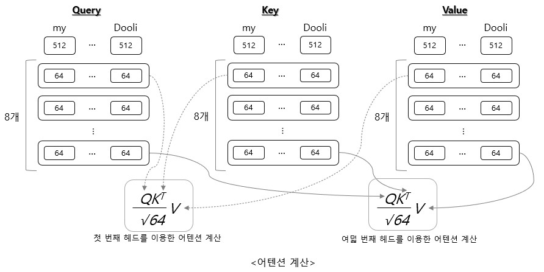

3장 안녕, 트랜스포머

위 그림을 보면 인코더 서브레이어에 셀프어텐션이 하나 있고, 디코더 서브레이어에는 셀프어텐션과 인코더 디코더 어텐션이 있다.

3개 모두 멀티헤드 어텐션 구조다.

### 멀티헤드 어텐션

- 입력값을 여러 개로 쪼개서 어텐션을 계산한다.
- 입력값이 쪼개지는 개수를 N으로 하면, 하나의 입력값을 N개로 쪼개서 각각 어텐션을 계산하게 된다.
- 결국 어텐션을 N번 하게 되는데, N번은 순차적이 아니라 동시에 병렬적으로 진행된다.
- 즉, 멀티헤드 어테션의 "멀티헤드"는 쪼개진 입력값이 N번 병렬적으로 실행될 수 있다는 의미를 갖고 있다.

중요한 과정이기 때문에 텐서 사이즈의 변화를 정리해 보도록 하자.

셀프어텐션과 인코더 디코더 어텐션을 연산하면, 다음 그림과 같은 어텐션 연산 결과를 갖게 된다.

트랜스포머 모델의 핵심이 이 부분이다!!!

위 그림과 같이 입력에 대한 어텐션 연산을 멀티헤드 방식으로 진행하는 것이다.

### 트랜스포머 구현하기

이제 앞에서 설명한 트랜스포머를 간단하게 구현해 보자.