## 4장 중간부터 학습하자! 사전 학습과 파인튜닝

사전 학습의 사전은 미리라는 의미를 지닌 사전이다.

파인튜닝은 이미 만들어져 있는 것을 조금 변형하는 것이다.

BERT 구조 뒤에 각자 만들고자 하는 모델의 성격에 따라 레이어를 추가해주면 끝이다.

BERT 이후에 나오는 트랜스포머 기반의 언어 모델은 거의 모두 사전 학습 후 파인튜닝하는 구조로 이뤄져 있다.

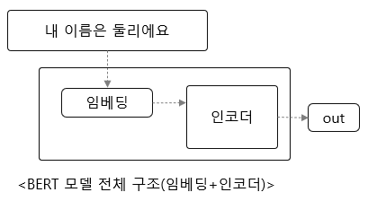

### BERT 모델의 입력 이해하기

BERT의 입력 데이터는 평뮨을 토큰화하는 것부터 시작한다.

BERT는 워드피스 포크나이저를 사용한다.

- 한 문장을 토큰화할 때 우선 더 이상 쪼갤 수 없는 유닛 단위로 쪼갠 후 인접하는 유닛들끼리 합쳐가면서 토큰을 만드는 알고리즘

각 토큰은 번호를 갖고 있다.

"There is my school and I love this place" 라는 문장에 대한 전체 구조는 다음 그림과 같다.

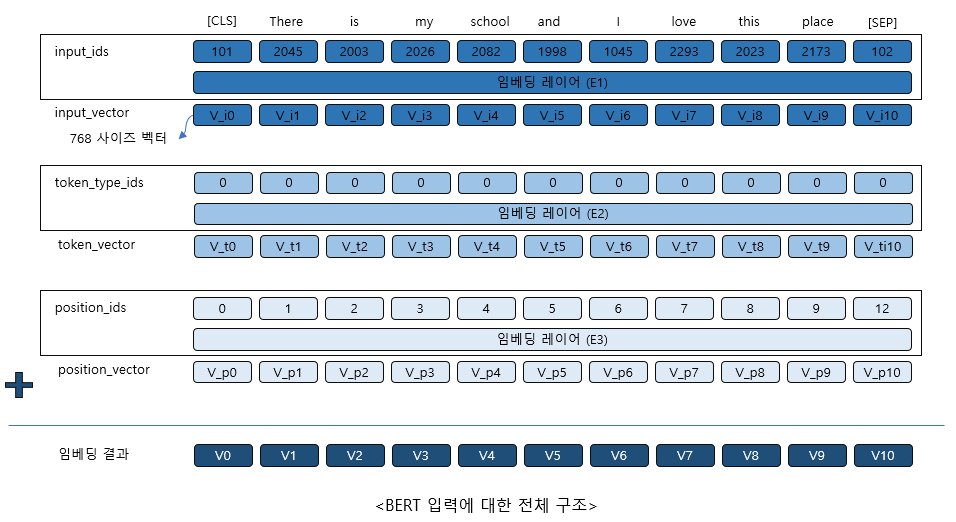

### 사전학습은
- MLM(Masked Language Model) 과 NSP(Next Sentence Prediction) 을 통해 학습한다.

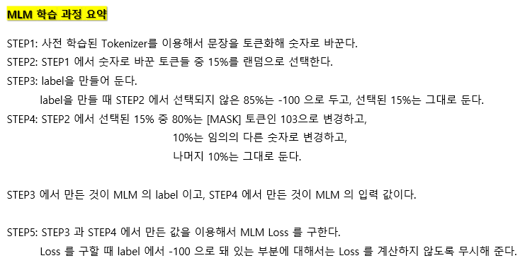

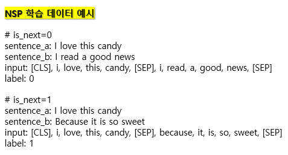

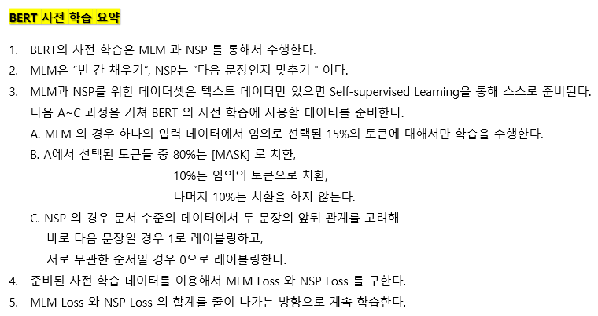

### 텍스트 분류 모델로 파인튜닝하기

- CoLA 데이터셋 사용: Corpus of Linguistic Acceptability
- transformers 라이브러리에 있는 BertForSequenceClassification 클래스 사용
- 추론 결과를 confusion matrix 로 표현 가능
- 평가 방법은 Matthews Correlation을 사용

### 질의응답 모델로 파인튜닝하기

- SQuAD 데이터셋 사용: Stanford Question Answering Dataset
- transformers 라이브러리에 있는 BertForQuestionAnswering 클래스 사용
- F1 스코어 확인

### GPT (Generative Pre-Training), 생성하는 사전 학습

- 위에서 설명한 BERT 는 Transformer 의 인코더 부분을 이용해서 만든 모델
- GPT 는 Transformer 의 디코더 부분을 이용해서 만든 모델

- 앞에 나온 단어를 이용해서 다음 단어를 맞춰나가는 방식으로 사전 학습을 진행

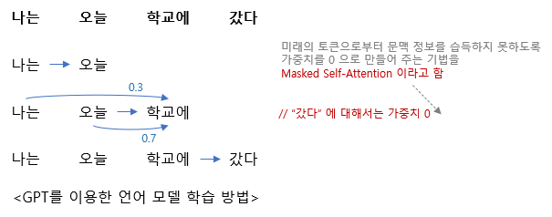

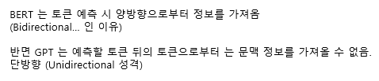

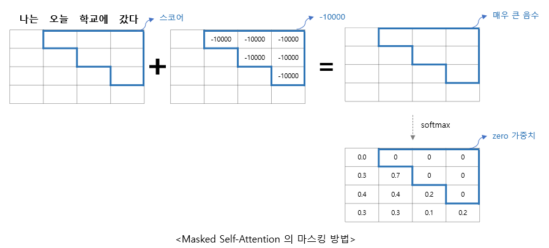

### RoBERTa

Facebook 에서 2019년 7월에 발표된 논문

"RoBERTa: A Robustly Optimized BERT Pretraining Approach"

BERT를 최적으로 학습하는 것이 핵심
- BERT의 구조와 동일
- MLM 학습할 때 데이터를 처리하는 방법
- NSP 를 처리하는 방법
- 배치 사이즈 조절
- 토크나이저 변경 
등의 방법을 이용

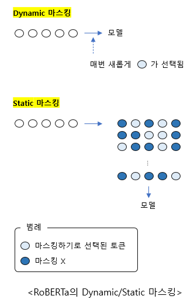

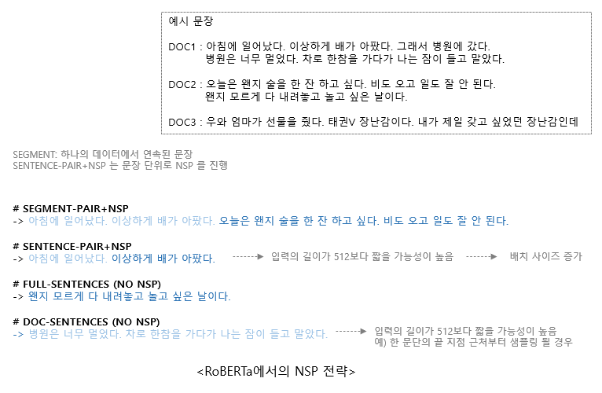

### ALBERT

2019년 7월에 Google Research 와 Toyota Technological Institute at Chicago 가 연구해서 발표한 언어 모델

BERT 의 모델 사이즈가 크다는 단점을 극복한 언어 모델

모델 사이즈를 줄이는 방법
- Factorized Embedding Parameterization
- Cross-layer Parameter Sharing

Factorized Embedding Parameterization
- BERT 에서는 임베딩 사이즈를 히든 사이즈와 같게 뒀다. (<BERT_입력에_대한_전체_구조> 참고)
- 임베딩 사이즈(E) 와 히든 사이즈 (H) 를 굳이 같은 값을 묶을 필요가 없다고 이야기하고 있다.

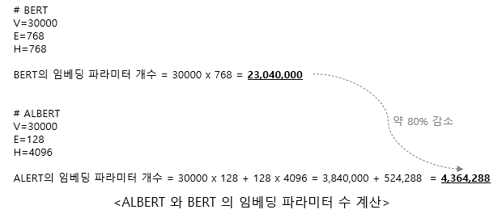

Cross-layer Parameter Sharing
- BERT 에서는 Self-Attention을 계산해서 H 차원의 결과값을 만들어내는 BertLayer 를 12번 반복한다.
- 이 때 파라미터를 공유하지 않으므로 같은 구조의 블록을 12개 만든다.
- ALBERT 에서는 이 구조의 블록을 1개 만들어서 재사용한다. -> 결과적으로 파라미터 공유

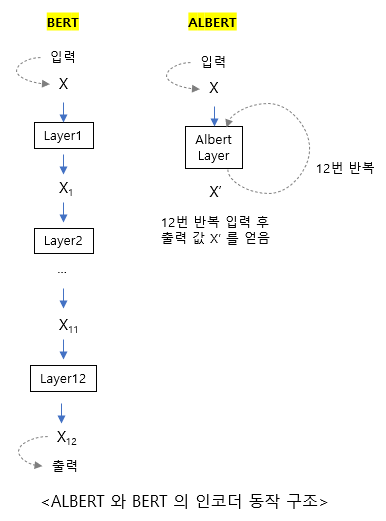

또 하나 짚고 넘어가야 할 부분인 "SOP (Sentence Order Prediction)"

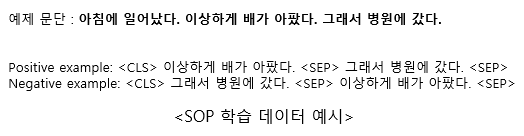

