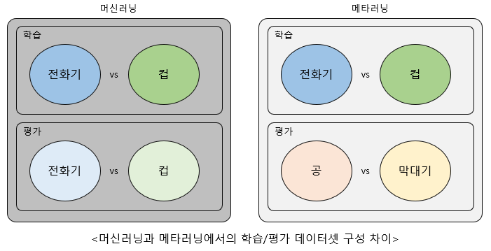
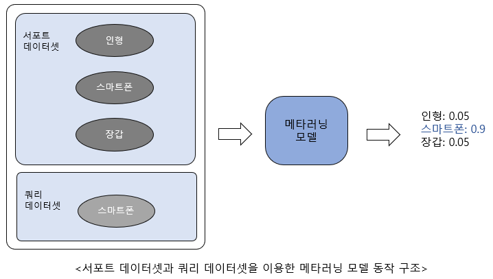
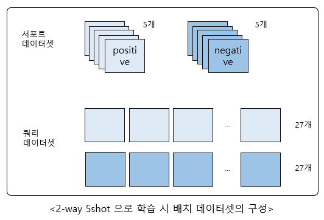

## 5장 어떻게 배우지? 메타러닝 (Meta Learning)

그때마다 데이터셋을 새로 모아 레이블링 하는 것은 매우 비효율적이다.

이 문제를 해결할 수 있는 방법이 바로 "메타러닝" 이다.

메타러닝은 학습법을 학습하는 것이라고 소개된다.

즉, 서로 다른 구성의 학습 데이터를 이용해서 구분할 줄 알도록 모델을 학습할 경우

전혀 새로운 데이터셋인 공/막대기같은 데이터가 들어와도 그 둘을 구분해낼 수 있게 된다.

예를 들면, 다음 그림처럼

스마트폰에 대해서 학습하지 않는 모델을 처음 만들 때 메타러닝을 고려해서 만들었다면, 추가적인 학습을 하지 않아도 된다.

간단하게 스마트폰 사진 몇 장과 스마트폰이 아닌 다른 클래스의 사진 몇 장을 모델에 입력으로 넣어주면

스마트폰이 아닌지 구분할 수 있게 된다.

### 메타러닝을 이용한 Amazon 리뷰 감정 분류 학습하기

Amazon 리뷰 데이터셋
- Amazon 에서 판매하는 물품을 종류별로 구분한 후 각 종류별로 긍정/부정 후기 모음
- 23개의 물품 리스트에 대한 데이터
- https://github.com/Gorov/DiverseFewShot_Amazon 에서 다운로드 가능

물품 리스트 중에서
- train.list 에 있는 물품들은 메타러닝 모델을 학습할 때 사용
- dev.list 에 있는 물품들을 이용해서 검증
- test.list 에 있는 물품들을 이용해서 테스트

메타러닝 학습에는
- N-way, K-shot 방식 사용
- N-way 의 N은 클래스의 개수로 긍정/부정 이므로 2
- K-shot 의 K 는 서포트 데이터셋의 개수

메타러닝 모델은 쿼리 데이터와 서포트 데이터의 관계를 학습
- 하나의 배치 데이터셋이 64개로 이뤄져 있음
- 서포트 데이터셋 10개 = positive 5, negative 5
- 쿼리 데이터셋 54개 = positive 27, negative 27
- 각 배치에 대해 서포트 데이터와 쿼리 데이터를 각각 인코딩한 후  
인코딩 된 서포트 데이터셋과 인코딩된 쿼리 데이터셋을 이용해서  
쿼리 데이터의 정답을 맞추는 방법으로 학습

